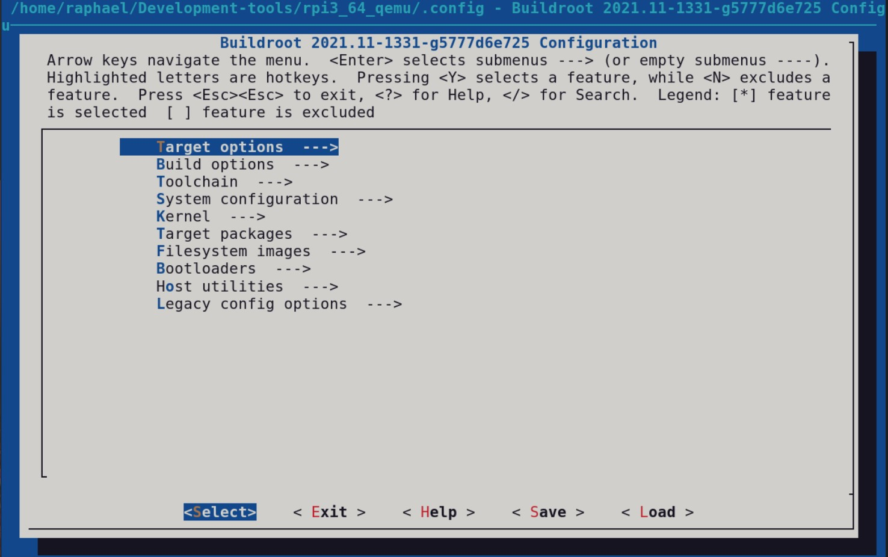
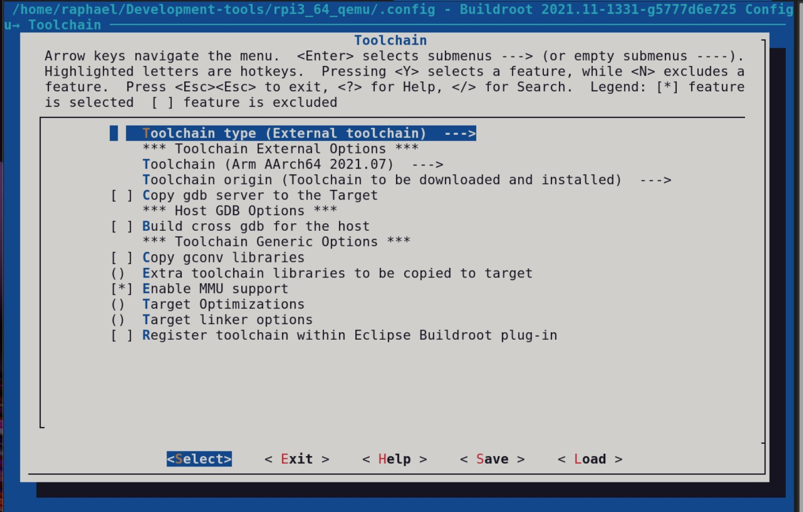
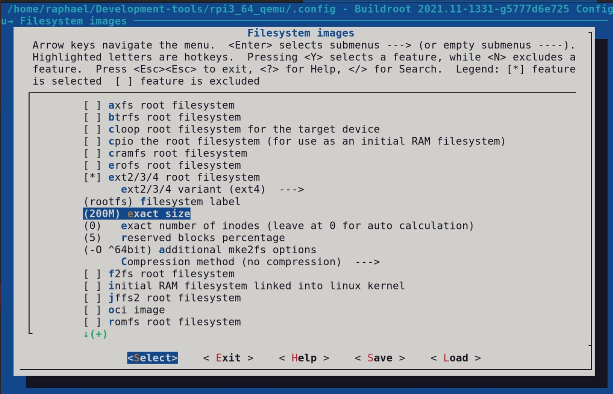
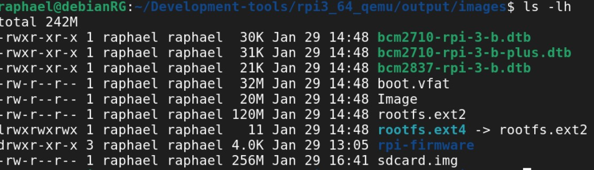
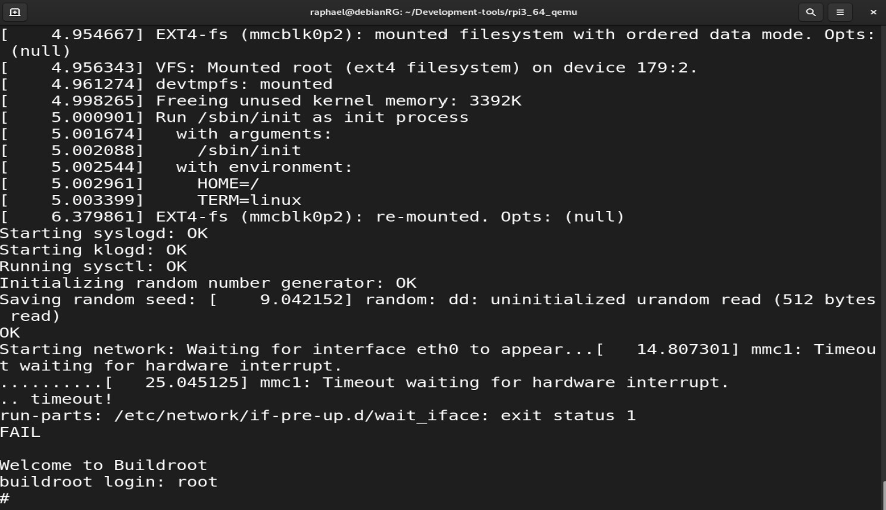

# Projet 5 | Raphaël GANDUS, Hamza RAHAL et Hicham GHANEM

## Partie 1 : création d'un microlinux pour Raspberry Pi 3b avec Buildroot

https://drive.google.com/drive/folders/11rCmgKJLSwS2XtPB7mQSHDyHXBX1_gZ8?usp=sharing

### 1) Préparation de l'environnement de travail

On commence par créer un répertoire de travail qu'on appelle Development-tools/ :
```bash
mkdir Development-tools/
```
Dans ce répertoire on clone le repository github officiel de Buildroot :
```bash
git clone https://github.com/buildroot/buildroot
```
Installation des packets et dépendences nécessaires :
```bash
sudo apt-get install libncurses5-dev bc
sudo apt-get install rsync
sudo apt-get install bc
```
On copie ensuite le fichier cloné buildroot dans un nouveau répertoire qu'on pourra modifier pour nos besoins : 
```bash
cd Development-tools/
cp -R buildroot/ rpi3_64_qemu
```
On se place dans le repertoire rpi3_64_qemu. On souhaite génerer un microlinux pour RaspberryPi 3b 64 bits. Il faut donc construire le fichier config correspondant à cette architecture :
```bash
make raspberrypi3_64_defconfig
```
### 2)Personalisation du microlinux

Pour acceder au menu de configuration, on éxecute la commande : 
```bash
make menuconfig
```
Une interface graphique apparaît avec de nombreuses options de personnalisation : 



On rentre ensuite dans le menu Toolchain : 



Dans Toolchain Type, choisir External Toolchain (celle générée par Buildroot est trop lourde et longue à compiler).

Dans Toolchain, choisir Arm AArch64 2021.07, compatible avec le processeur AArch64 de la RaspberryPi 3b.

On revient ensuite en arrière puis on rentre dans le menu Filesystem images :



On change la valeur de exact size à 200M sinon la capacité sera trop petite.
Enfin on clique sur "save" puis "exit" pour sortir du menu.

Finalement, on éxecute le build du microlinux avec la commande :  
```bash
make
```
Après une longue compilation, on obtient dans le fichier output/images les fichiers suivant :



### 3)Test du microlinux avec QEMU et émulation d'une RaspberryPi 3b

On commence par installer QEMU pour architecture ARM :
```bash
sudo apt-get install qemu-system-arm
```

Dans le répertoire rpi3_64_qemu, on crée un script shell contenant la commande suivante :
```bash
#!/bin/bash

qemu-system-aarch64 -M raspi3 -m 1024 \
                    -cpu cortex-a57 \
                    -kernel output/images/Image \
                    -dtb output/images/bcm2710-rpi-3-b.dtb \
                    -drive file=output/images/sdcard.img,format=raw \
                    -append "console=ttyAMA0 root=/dev/mmcblk0p2 rw panic=1 rootwait rootfstype=>
                    -net nic -net user \
                    -nographic
```
Ce script va émuler une RaspberryPi 3b contenant un processeur cortex-a57, et qui utilise comme systèe d'exploitation le microlinux généré par Buildroot, grâce aux fichiers Image(kernel), bcm2710-rpi-3-b.dtb(fichier dtb), et sdcard.img

Lorsqu'on éxecute ce script, on rentre bien dans l'invite de commande d'une Raspberry : 




### Partie 2 : création d'une application BLE avec Node Red

